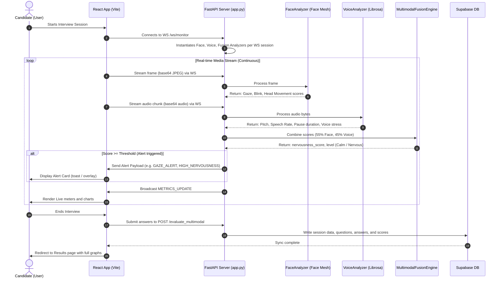

# System Architecture: AI-Powered Multimodal Interview Evaluation System

This document outlines the folder structure, data flow, FastAPI backend service architecture, React component layout, and deployment model.

---

## 1. Folder Structure

The directory setup for the project is as follows:

```
├── backend/
│   ├── app.py                      # Main FastAPI server entry point
│   ├── requirements.txt            # Python dependencies (mediapipe, librosa, etc.)
│   └── analyzers/
│       ├── face_analyzer.py        # Gaze tracking, blinks, and head movement
│       ├── voice_analyzer.py       # Speech rate, pitch, and silence estimation
│       └── fusion_engine.py        # Weighted multimodal nervousness fusion
│
├── src/
│   ├── components/
│   │   ├── InterviewDashboard.tsx  # Interactive dashboard UI
│   │   └── WebcamFeed.jsx          # Simple webcam capture utility
│   │
│   ├── pages/
│   │   ├── Interview.tsx           # Session management & media streaming
│   │   ├── Results.tsx             # Evaluation results visual display
│   │   └── Dashboard.tsx           # User workspace
│   │
│   ├── integrations/
│   │   └── supabase/
│   │       ├── client.ts           # Supabase client instantiation
│   │       └── types.ts            # Supabase database typescript types
│   │
│   └── vite.config.ts              # Frontend configurations
│
└── supabase/
    └── schema.sql                  # Database tables, indexes, and RLS rules
```

---

## 2. Data Flow Diagram

Below is a sequence diagram showing the flow of media, analysis, fusion, and real-time alert triggers:



---

## 3. FastAPI Service Architecture

The backend FastAPI server relies on async processing to maintain scalability when handling continuous streams:

1. **Connection Manager**:
   - Manages active websocket connections.
   - Restricts operations per-session to prevent cross-candidate state bleeding.
2. **Modular Analyzers**:
   - Built to run independently.
   - Robust `try-except` blocks protect the loop from terminating if a single video frame is corrupted or an audio packet contains noise.
   - Automatic CPU-bound simulation fallback triggers when computer vision modules (like MediaPipe or OpenCV) fail to initialize or are unavailable, ensuring continuous server uptime.
3. **Multimodal Fusion Engine**:
   - Evaluates incoming updates using the user-defined weights.
   - Emits alerts instantly when metrics fall below acceptable thresholds.

---

## 4. React Component Architecture

- **`Interview.tsx`**:
  - Serves as the orchestrator.
  - Initializes WebSockets connection.
  - Controls browser media capture (`navigator.mediaDevices.getUserMedia`).
  - Schedules canvas capture intervals (e.g., 5 frames per second) and streams audio chunks using a MediaRecorder.
- **`InterviewDashboard.tsx`**:
  - Renders child layout: Live feed canvas, WebGL indicators, transcription feed.
  - Incorporates the `recharts` package to plot real-time metrics during the interview, giving immediate visual feedback.

---

## 5. Deployment Architecture

```
                 +-----------------------+
                 |    CloudFlare DNS     |
                 +-----------+-----------+
                             |
                             | HTTPS / WSS
                             v
                 +-----------+-----------+
                 |    NGINX Reverse      |
                 |      Proxy / SSL      |
                 +-----------+-----------+
                             |
             +---------------+---------------+
             | WS/HTTP                       | HTTP
             v                               v
  +----------+----------+        +-----------+-----------+
  |    FastAPI Backend   |        |   React SPA Hosting   |
  |     (Uvicorn app)    |        | (Vercel/Static Serve) |
  +----------+----------+        +-----------------------+
             |
             | DB Queries (REST / WebSockets)
             v
  +----------+----------+
  |    Supabase Cloud   |
  |   (PostgreSQL)      |
  +---------------------+
```

- **Backend Scaling**:
  - Deploy backend inside Docker containers behind Nginx or AWS ALB.
  - Run Uvicorn with multiple workers for multi-threaded performance.
- **WebSocket Scaling**:
  - For production-grade concurrent sessions, implement a Redis Pub/Sub adapter to manage websocket connections across multiple running server instances.
